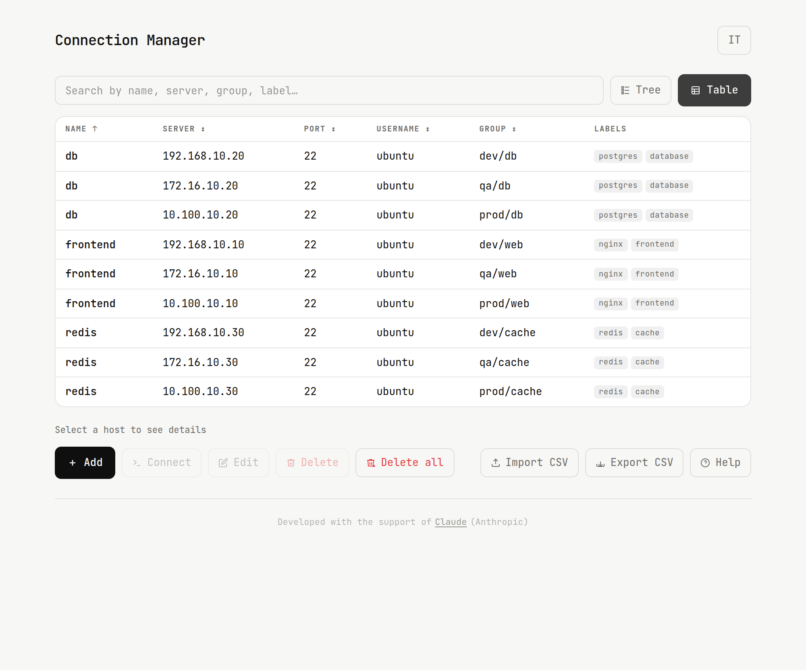
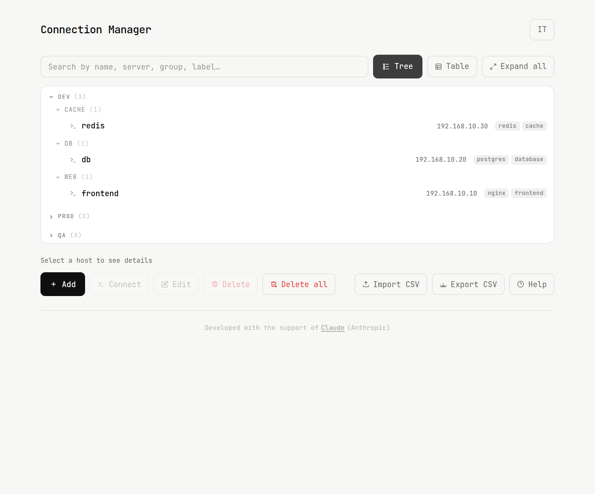

# Connection Manager

Connection Manager keeps all SSH connections organized in one place. Browse them in tree or table view, filter by any field in real time, import and export via CSV, and connect instantly opening a native terminal.

---

## Screenshot

### Table mode


### Tree mode


---

## Features

- Manage SSH connections with name, server, port, username and group
- Tree view grouped by environment and group
- Table view with sortable columns
- Real-time search across all fields
- Import connections from CSV
- Export connections to CSV
- Opens a native terminal on connect

---

## Install

```bash
curl -fsSL https://github.com/gsandrini/connection-manager/releases/latest/download/install.sh | bash
```

---

### Uninstall

```bash
curl -fsSL https://github.com/gsandrini/connection-manager/releases/latest/download/install.sh | bash -s -- --uninstall
```

---

## Tech stack

| Tool | Role                              |
|------|-----------------------------------|
| [Wails](https://wails.io) | Desktop framework (Go + WebView)  |
| [Go](https://golang.org) | Backend - opens native SSH terminal |
| [Alpine.js](https://alpinejs.dev) | Reactive UI (bundled locally) |
| [Tailwind CSS](https://tailwindcss.com) | Styling (compiled locally) |
| [JetBrains Mono](https://www.jetbrains.com/lp/mono/) | Typography  |

---

## Built with

This project was built with the support of [Claude](https://claude.ai) by Anthropic.

---

## Contributing

This repository is published for personal use / GitHub Pages only.
Pull requests and issues will not be reviewed or accepted.

---

## License

This project is licensed under the **GNU General Public License v3.0**.
See the [LICENSE](LICENSE) file for details.
