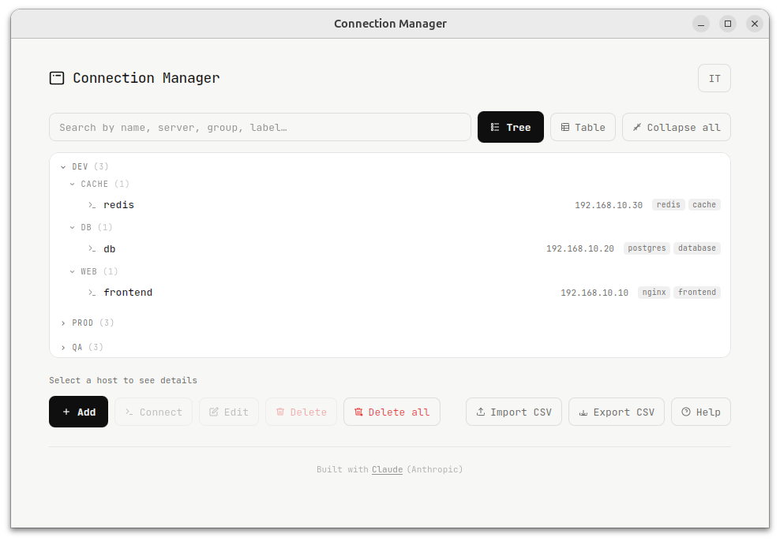
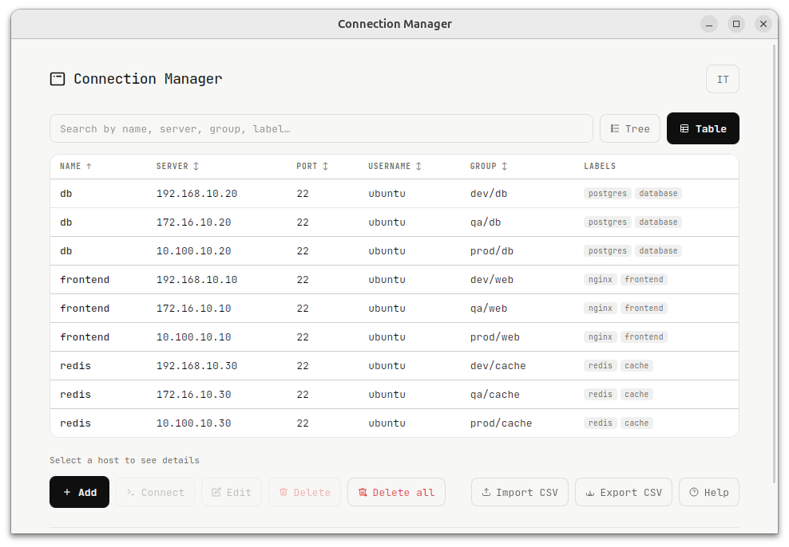

# Connection Manager

A desktop app to manage and connect to SSH hosts.

---

## Screenshot

### Tree mode

### Table mode

---

## Features

- Manage SSH connections with name, server, port, username and group
- Tree view grouped by environment and group
- Table view with sortable columns
- Real-time search across all fields
- Import connections from CSV
- Export connections to CSV
- Opens a native terminal on connect

---

## Tech stack

| Tool | Role |
|------|------|
| [Wails](https://wails.io) v2 | Desktop framework (Go + WebView) |
| [Go](https://golang.org) | Backend — opens native SSH terminal |
| [Alpine.js](https://alpinejs.dev) v3 | Reactive UI (bundled locally) |
| [Tailwind CSS](https://tailwindcss.com) | Styling (compiled locally) |
| [JetBrains Mono](https://www.jetbrains.com/lp/mono/) | Typography |

---

## Built with

This project was built with the assistance of [Claude](https://claude.ai) by Anthropic.

---

## Contributing

This repository is published for personal use / GitHub Pages only.
Pull requests and issues will not be reviewed or accepted.

---

## License

This project is licensed under the **GNU General Public License v3.0**.
See the [LICENSE](LICENSE) file for details.
